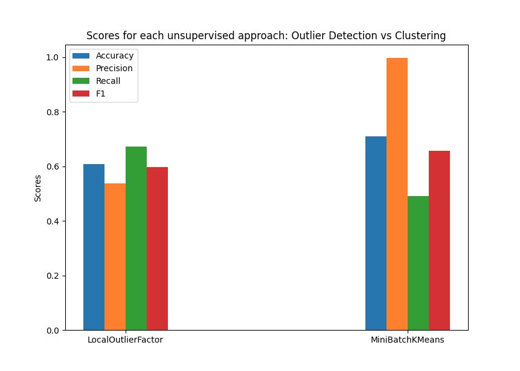

# Intrusion detection via machine learning
An intrusion detection machine learning system in an unsupervised fashion.

## Data
The dataset that is utilized is the "NSL-KDD" dataset. The train and the test datasets are in the `data/` folder.
The training dataset however has no labels. As a result the machine learning process must follow an 
unsupervised approach.

## Unsupervised learning

The problem is tackled with 2 approaches.

1. As an outlier detection problem
2. As a clustering problem

### Outlier detection

An outlier value would match an attack TCP connection, where an inlier would match a normal TCP connection,
based on the assumption that the normal TCP connections would be more than attack ones and would appear 
closer to each other.

### Clustering

Cluster the data into to 2 groups. The one cluster would refer to the attack connections and the other to the normal 
connections. Then we evaluate how many examples of the test set were correctly clustered in the normal and attack
clusters and there were indeed what the algorithm predicted.

## Performance

### Outlier detection

| Model              | Accuracy | Precision | Recall  | F1-score |
|--------------------|----------|-----------|---------|----------|
| LocalOutlierFactor | 0.60943  | 0.53732   | 0.67161 | 0.59701  |
| IsolationForest    | 0.43094  | 0.43083   | 1.00000 | 0.60221  |

### Clustering

| Model           | Accuracy | Precision | Recall  | F1-score |
|-----------------|----------|-----------|---------|----------|
| KMeans          | 0.52919  | 0.99776   | 0.17330 | 0.29531  |
| MiniBatchKMeans | 0.70906  | 0.99668   | 0.49053 | 0.65748  |
| Birch           | 0.63529  | 0.98323   | 0.36554 | 0.53295  |

## Comparing diagram

